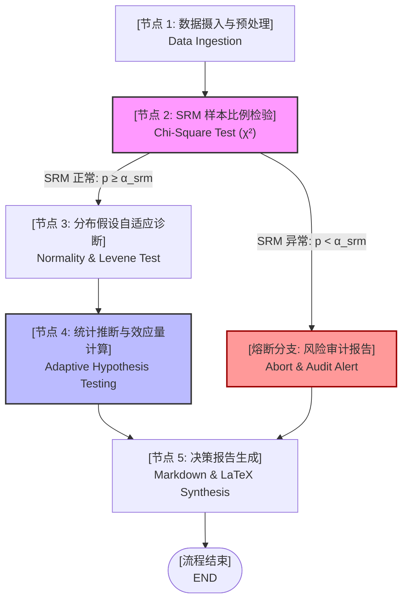

# Auto-ABTest Agent: 自动化 A/B 实验分析与统计诊断智能体

[](https://www.python.org/downloads/)
[](https://github.com/langchain-ai/langgraph)
[](https://scipy.org/)
[](LICENSE)

> **面向数据科学、统计推断与大模型 Agent 领域的高壁垒开源决策系统。**  
> 告别同质化的玩具级应用，将**严格的数理统计推断理论**与**工业级 LangGraph 状态机决策流**深度融合，构建杜绝数值计算幻觉的端到端自动化 A/B 实验决策系统。

---

## 📌 项目背景与核心痛点

在现代互联网业务与数字化产品中，A/B 实验是因果推断与版本迭代的黄金准则。然而，企业在日常实验分析中常面临两大痛点：
1. **统计学滥用与决策失真**：超过 80% 的业务分析师盲目套用经典双样本 $t$ 检验，忽视了分流系统故障带来的**样本比例失衡 (Sample Ratio Mismatch, SRM)**、指标长尾分布导致的严重偏态，以及方差不齐引起的第一类错误率 ($\alpha$) 膨胀，导致依据辛普森悖论做出错误的商业上线决策。
2. **大模型数值计算幻觉**：直接让 LLM 进行数据运算极易产生虚假的均值和假冒的 $p$-value，缺乏数理可复现性。

**Auto-ABTest Agent** 创新性地提出 **Code-as-Truth（代码即真理）** 智能体架构：所有的统计检验量由底层的 SciPy/Statsmodels 精确计算，大模型仅负责业务语义理解与决策报告升华，从根本上兼顾了**数理严谨性**与**智能决策力**。

---

## 🏗️ 系统架构与状态机设计

本系统基于 **LangGraph 有向状态图 (StateGraph)** 构建，包含 5 个核心处理节点与动态条件路由门禁：



### 智能体决策闭环机制：
1. **SRM 守门员熔断 (Gatekeeper)**：前置检验 $n_c$ 与 $n_t$ 是否符合理论设计分流比。若触发 SRM 异常，条件边立即阻断后续推断流转，防止误导性决策；
2. **自适应检验路由 (Adaptive Routing)**：
   * 两组均满足正态性且方差齐 $\rightarrow$ **Student's $t$-test**；
   * 两组满足正态性但方差不齐 $\rightarrow$ **Welch's $t$-test**（Satterthwaite 自由度近似修正）；
   * 任一组呈现偏态/长尾 $\rightarrow$ **Mann-Whitney $U$ 非参数秩和检验**；
   * 全流程自动运行 **Non-parametric Bootstrap ($B=2000$)** 构造经验置信区间交叉印证。
3. **效应量无量纲度量**：计算 **Cohen's $d$** 与相对提升率，明确区分“统计显著”与“业务显著”。

---

## 🧮 统计学数理方法论

### 1. 样本比例失衡 (Sample Ratio Mismatch, SRM)
采用卡方拟合优度检验（Goodness-of-Fit $\chi^2$ Test）：
$$\chi^2 = \sum_{i \in \{c, t\}} \frac{(O_i - E_i)^2}{E_i} \sim \chi^2(1)$$
若 $p < 0.01$，判定流量网关分配或埋点上报存在系统性故障。

### 2. 方差齐性检验 (Levene's Test - Brown-Forsythe 稳健变体)
采用中位数作为离差中心：
$$W = \frac{(N-k)}{(k-1)} \frac{\sum_{i=1}^k N_i (\bar{Z}_{i\cdot} - \bar{Z}_{\cdot\cdot})^2}{\sum_{i=1}^k \sum_{j=1}^{N_i} (Z_{ij} - \bar{Z}_{i\cdot})^2}, \quad Z_{ij} = |Y_{ij} - \tilde{Y}_{i}|$$

### 3. Welch's $t$-test 异方差修正
针对互联网业务中方差不齐的常态，调整有效自由度 $\nu$：
$$\nu \approx \frac{\left( \frac{s_c^2}{n_c} + \frac{s_t^2}{n_t} \right)^2}{\frac{(s_c^2/n_c)^2}{n_c-1} + \frac{(s_t^2/n_t)^2}{n_t-1}}$$

### 4. 效应量 Cohen's $d$
$$d = \frac{\bar{X}_t - \bar{X}_c}{S_{\text{pooled}}}, \quad S_{\text{pooled}} = \sqrt{\frac{(n_c-1)s_c^2 + (n_t-1)s_t^2}{n_c + n_t - 2}}$$

---

## 📂 项目结构说明

```
├── data/
│   ├── generate_sample_data.py          # 模拟业务数据生成器 (偏态、异方差、SRM异常)
│   ├── ab_watch_duration_skewed.csv     # 场景1：长尾对数正态指标（用户停留时长）
│   ├── ab_satisfaction_heteroscedastic.csv # 场景2：方差不齐指标（用户打分）
│   └── ab_srm_anomaly.csv               # 场景3：SRM 分流故障数据
├── src/
│   ├── __init__.py
│   ├── config.py                        # 全局配置 (显著性水准 α, API Key 等)
│   ├── state.py                         # LangGraph 状态定义契约 (ABTestState)
│   ├── stats_engine.py                  # 纯数学统计推断引擎 (无幻觉计算核心)
│   ├── agent_workflow.py                # LangGraph 状态图与条件路由拓扑
│   └── report_generator.py              # 决策报告生成与 LaTeX 渲染器 (支持在线与离线模板)
├── app.py                               # 基于 Streamlit + Plotly 的 Web 交互仪表盘
├── run_cli.py                           # 命令行一键测试脚本
├── requirements.txt                     # 依赖包列表
├── LICENSE                              # MIT 开源许可证
└── README.md                            # 项目公开技术说明文档
```

---

## 🚀 快速上手与运行

### 1. 安装依赖
```bash
pip install -r requirements.txt
```

### 2. 生成多场景样例数据
```bash
python data/generate_sample_data.py
```

### 3. 命令行一键运行测试
```bash
python run_cli.py
```

### 4. 启动 Web 可视化看板
```bash
streamlit run app.py
```
> 系统在未配置 API Key 时将**自动启用内置学术级确定性离线渲染引擎**，零网络依赖；若配置了 DeepSeek 或 OpenAI Key，将调用大模型生成定制化的高管级深度商业洞察。

---

## 👨‍💻 作者与学术背景 (Author & Affiliation)

* **开发者**：Jiawen (嘉文) · 统计学硕士研究生 (Master of Statistics)
* **研究机构**：浙江工商大学 · 统计与数学学院
* **主要研究兴趣**：数理统计推断、大模型 Agent 状态机架构、数据科学与因果推断
* **GitHub 项目主页**：[Auto-ABTest-Agent](https://github.com/nguyenthihuyen42061-sys/Auto-ABTest-Agent)

---

## 📄 版权与开源协议 (License)

本项目采用 [MIT License](LICENSE) 开源协议。所有数理推导模型、状态机架构设计与实现代码版权归原作者所有，欢迎学术研究与交流探讨。
